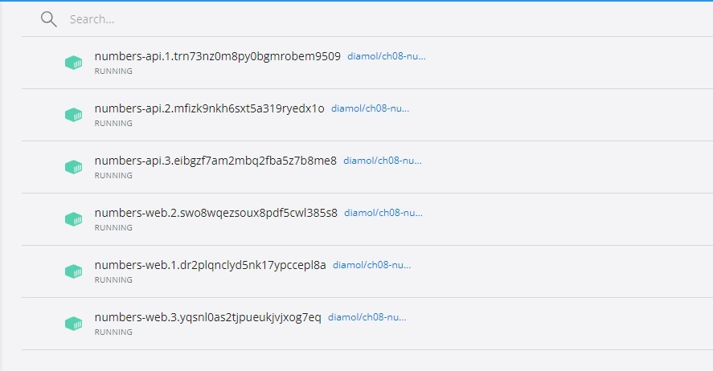
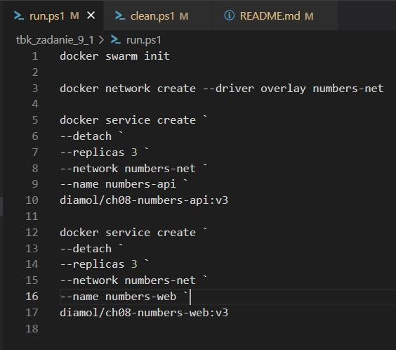
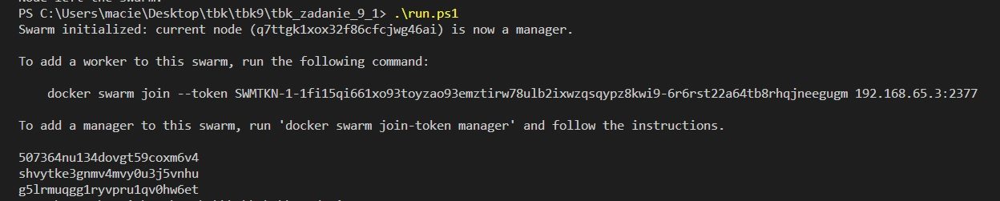
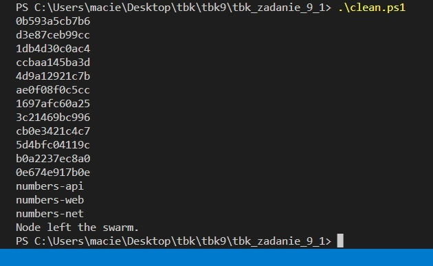

# Instrukcja
W folderze z plikiem docker-compose.yml i docker-compose-test.yml:
```sh
.\run.ps1
```
Po zatrzymaniu docker-compose można usunąć niepotrzebne kontenery, wolumin i folder pgdata poleceniem:
```sh
.\clean.ps1  
``` 
# Screenshot
#### Docker Desktop - po uruchomieniu widzimy stworzone numbers-api oraz numbers-web

#### Polecenia z .\run.ps1

#### Po odpaleniu .\run.ps1 (widok konsoli)

#### Po odpaleniu .\clean.ps1
